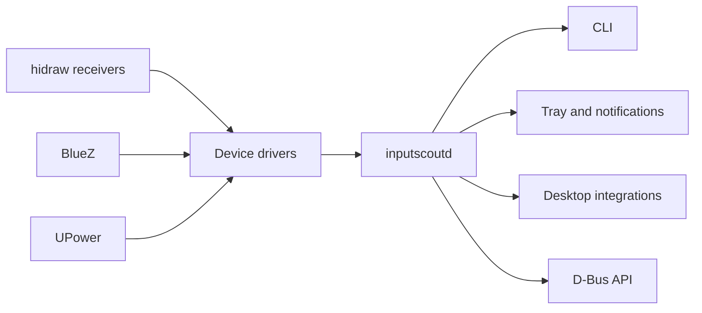

# InputScout roadmap

InputScout is intended to become a Linux-first device intelligence and control
layer for wireless keyboards, mice, and other input hardware. The project will
remain vendor-independent at the product level: individual drivers may support
specific hardware, while the CLI, service, and desktop interfaces expose a
common capability model.

This roadmap is ordered by dependency and risk. Milestone numbers describe
project maturity rather than promised release dates.

## Product direction

The daemon will own hardware access and state caching. User interfaces will be
clients of its versioned D-Bus API instead of opening HID devices independently.

## v0.1 — hardware-validated CLI

Status: **complete**

- [x] Detect the Keychron Ultra-Link 8K and Link receivers.
- [x] Resolve the attached M5 8K and K8 HE device identities.
- [x] Report M5 8K battery percentage and charging state.
- [x] Provide human-readable and JSON output.
- [x] Apply least-privilege `udev` access to configuration interfaces only.
- [x] Test parsers using captured real-device responses.
- [x] Validate the implementation on physical hardware and in CI.
- [x] Read K8 HE wired firmware, mode, feature, and active HE profile telemetry.

## v0.2 — protocol and diagnostics foundation

Goal: make new device work safe, repeatable, and testable without physical
hardware in every development loop.

- Introduce transport and driver interfaces so HID, Bluetooth, and replayed
  captures use the same device API.
- Replace model-specific conditionals with a device and capability registry.
- Add `inputscout devices` with stable identifiers and capability output.
- Add `inputscout doctor` for permissions, receiver interfaces, firmware
  identity, daemon state, and conflicting-process checks.
- Add a redacted diagnostics bundle containing report descriptors, versions,
  supported capabilities, and recent protocol errors.
- Store protocol response fixtures and add an offline replay transport.
- Fuzz all binary parsers and reject malformed lengths and invalid values.
- Define stable JSON types for unavailable, unsupported, sleeping, and stale
  state instead of relying on omitted fields.
- Document known HID reports and the provenance of each reverse-engineered
  field.

Definition of done: all supported-device behavior can be exercised in CI from
fixtures, and a user can produce a useful support bundle without exposing key
events, serial numbers, or unrelated USB devices.

## v0.3 — background service and event model

Goal: one low-privilege process owns device communication and exposes cached
state to any number of clients.

- Add `inputscoutd` as a per-user systemd service.
- Expose a versioned D-Bus API, initially `io.github.spdg.InputScout1`.
- Detect receiver hotplug, device wake/sleep, reconnects, and mode changes.
- Poll active devices conservatively and exponentially back off when asleep.
- Publish D-Bus signals only when state changes.
- Cache the last known state together with its timestamp and freshness.
- Prevent concurrent transactions from the CLI, daemon, and vendor launcher.
- Support per-device polling intervals and low-battery thresholds.
- Add structured logs and `inputscout logs` with safe redaction.

Definition of done: unplugging, reconnecting, or waking a device updates clients
without restarting the service, and normal monitoring does not noticeably
reduce battery life.

## v0.4 — mouse observability

Goal: expose useful M5 8K state before allowing any configuration writes.

- Read active profile and DPI stage.
- Read configured DPI values and polling rate.
- Read sleep timeout and available performance options.
- Read firmware and receiver versions where the protocol exposes them.
- Report onboard button mappings in a normalized form.
- Build a capability matrix rather than assuming that every mouse supports
  every command.
- Detect state changed externally by Keychron Launcher.
- Add `inputscout get <device> <setting>` and a complete JSON status document.

Definition of done: InputScout can produce a faithful read-only snapshot of the
M5 8K configuration and compare two snapshots.

## v0.5 — safe device control

Goal: configure supported hardware without risking profiles or firmware.

- Add guarded writes for DPI, polling rate, profile selection, sleep timeout,
  lighting, and supported performance options.
- Require explicit device selection when more than one compatible device is
  present.
- Add `--dry-run`, range validation, and a read-after-write verification step.
- Save a configuration snapshot before the first modification.
- Add restore and rollback commands.
- Serialize transactions and warn when Keychron Launcher has the interface
  open.
- Separate reversible settings from higher-risk actions in both code and UI.
- Keep firmware flashing outside the stable control API.
- Add button remapping only after snapshots and rollback are proven reliable.

Definition of done: every supported write is validated, confirmed by a fresh
read, and reversible from a saved snapshot.

## v0.6 — keyboard telemetry and K8 HE research

Goal: determine the safest route to K8 HE battery and useful keyboard state.

Status: **in progress; the wired read-only slice landed early**

- Test whether K8 HE exposes the standard BlueZ `Battery1` interface in
  Bluetooth mode.
- Compare wired, Bluetooth, and 2.4 GHz traffic without changing keyboard
  configuration.
- Map receiver commands beyond the currently known identity query.
- [x] Document the currently implemented commands that require a cable.
- Document which additional Launcher commands can cross the
  receiver transport.
- [x] Read firmware version, device mode, OS layer, and available onboard state where
  supported.
- Evaluate a minimal upstreamable QMK raw-HID battery query.
- Patch firmware only if standard Bluetooth and receiver approaches fail, and
  keep stock-firmware support as the primary path.
- [x] Read the active Hall-effect profile and global actuation settings without writes.

Definition of done: either battery telemetry works on stock firmware over at
least one wireless mode, or the limitation and a safe opt-in firmware path are
fully documented and reproducible.

## v0.7 — desktop experience

Goal: make device state visible without turning InputScout into a permanently
open configuration application.

- Add a StatusNotifier/AppIndicator tray client backed by D-Bus.
- Show battery, charging, connection, profile, and stale-state indicators.
- Send configurable low-battery, charging-complete, disconnect, and critical
  error notifications.
- Add quick actions for profile and DPI changes after safe writes land.
- Provide monochrome symbolic icons and full-color application icons.
- Follow light/dark themes, keyboard navigation, and screen-reader semantics.
- Evaluate native GNOME Quick Settings and KDE Plasma widgets as optional
  clients, not separate hardware backends.
- Investigate exporting supported devices to UPower so existing desktop battery
  surfaces can consume the data.

Definition of done: the daemon has no GUI dependency, the cross-desktop tray is
fully usable, and desktop-specific integrations can be installed independently.

## v0.8 — packaging and releases

Goal: install and upgrade InputScout like a normal Linux application.

- Produce versioned GitHub releases with checksums and changelogs.
- Package the CLI, daemon, D-Bus policy, systemd user unit, icons, desktop file,
  AppStream metadata, and precise `udev` rules together.
- Start with Debian/Ubuntu packages; add RPM and AUR packaging after the layout
  stabilizes.
- Build supported architectures natively because HIDAPI uses CGO.
- Add shell completions and manual pages.
- Generate an SBOM and publish dependency/license information.
- Sign release artifacts and document reproducible build inputs.
- Add an upgrade migration path for configuration and cached state.

Definition of done: a clean Ubuntu installation can install, use, upgrade, and
remove InputScout without manual file copying or leftover permissions.

## v0.9 — driver ecosystem and additional hardware

Goal: make adding another device a bounded driver task rather than a rewrite.

- Publish a driver authoring guide and protocol fixture format.
- Add a safe `inputscout probe` workflow that never captures normal keypresses.
- Support additional devices using the same Keychron receiver families.
- Add standard Bluetooth battery devices through BlueZ when UPower does not
  already provide equivalent data.
- Prefer delegation to mature tools such as Solaar instead of duplicating
  vendor support that Linux already handles well.
- Define capability-based UI rendering so unknown settings are never shown.
- Add a hardware validation matrix with firmware, transport, and kernel versions.

Definition of done: a contributor can add a read-only driver using fixtures and
CI before a maintainer validates it on physical hardware.

## v1.0 — stable Linux release

- Stable CLI JSON and D-Bus contracts with documented compatibility rules.
- Automatic hotplug and conservative power behavior proven over long runs.
- M5 8K read/control support and the best safe K8 HE telemetry path available.
- Complete package lifecycle and signed releases.
- Security review of HID permissions, parser boundaries, diagnostics, and write
  operations.
- User, contributor, driver, troubleshooting, and recovery documentation.
- No cloud account, mandatory telemetry, or network dependency.

## Later opportunities

These are useful, but should not delay a reliable local-first v1.0:

- Battery history, discharge-rate graphs, and estimated time remaining.
- Battery health estimation when hardware exposes enough charging data.
- Profile switching based on the focused application or game.
- Import/export of portable device profiles.
- Optional native GNOME and KDE clients.
- A local metrics endpoint for users who already monitor desktop machines.
- Support for split keyboards, macro pads, and other HID device classes.
- macOS or Windows transports if contributors want them; Linux remains the
  reference platform.

## Explicit non-goals before v1.0

- Firmware flashing or receiver firmware updates.
- Capturing normal keyboard input, typed text, or mouse movement.
- A cloud service, account system, analytics, or remote configuration.
- Replacing the Linux input stack or desktop settings applications.
- Reimplementing mature vendor tools when integration is sufficient.

## Recommended next implementation slice

The next slice should combine one architectural improvement with immediately
visible user value:

1. Introduce the transport/driver boundary and replay fixtures.
2. Add `inputscout doctor` and explicit battery availability in JSON.
3. Implement read-only M5 8K profile, DPI, and polling-rate queries.
4. Add the initial D-Bus contract and per-user daemon skeleton.
5. Package the current CLI and `udev` rule as a development `.deb`.

This order reduces protocol risk before settings writes and gives the future
tray, desktop widgets, and automation clients one stable backend.
